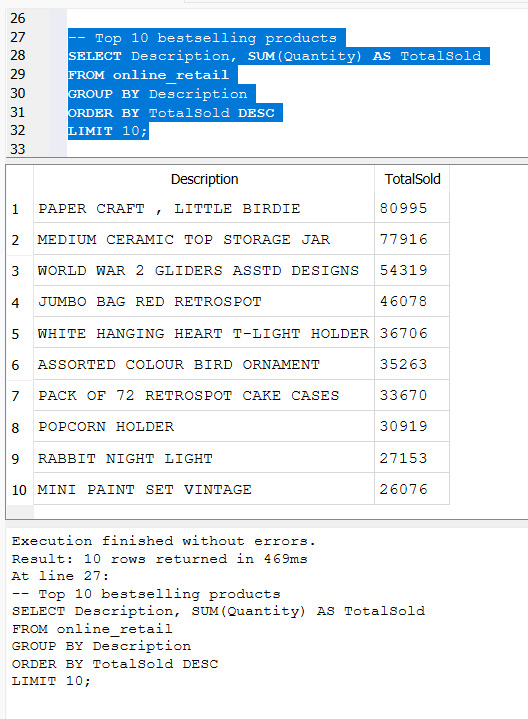
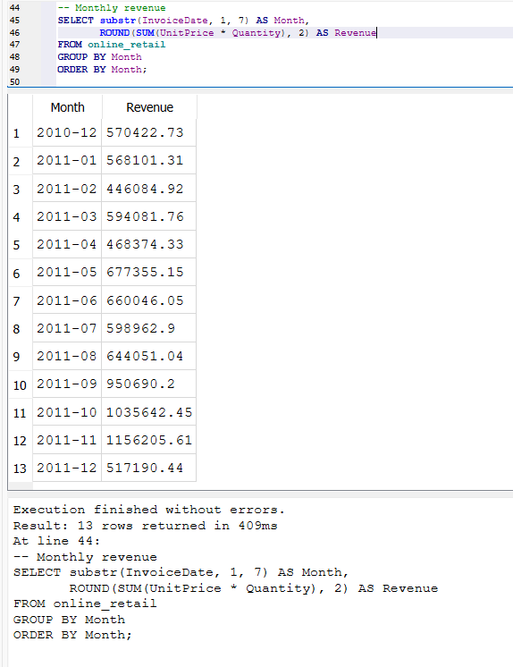
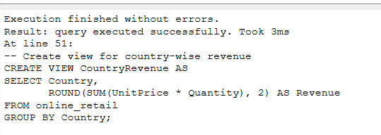
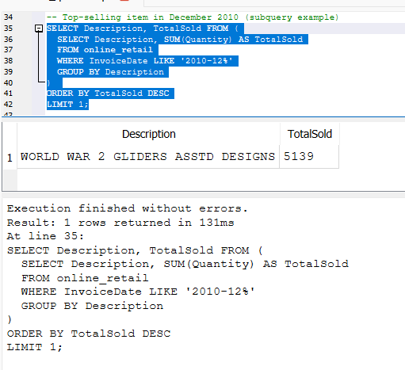
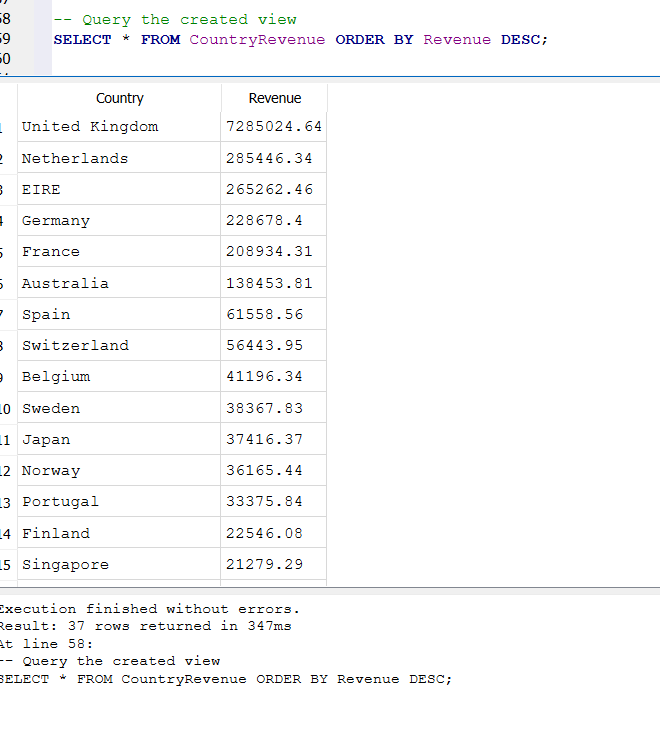
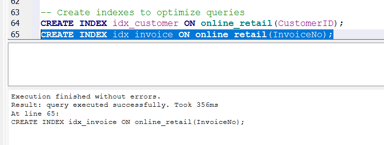
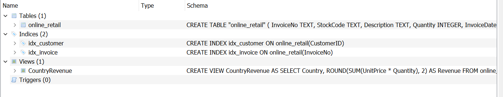

# 🛍️ Online Retail Data Analysis with SQLite

This project demonstrates SQL-based data cleaning, exploration, and analysis using the **Online Retail** dataset. The analysis was performed using **DB Browser for SQLite**, and the queries are designed to uncover business insights from real-world ecommerce transaction data.

---

## 📁 Files Included

- `online_retail_cleaned.csv` – Cleaned dataset used for import.

---

## 📊 Dataset Overview

The dataset contains transaction data for a UK-based online retailer. Each row represents a product purchased by a customer in a single invoice.

### Columns:
- `InvoiceNo` – Invoice number (should be treated as TEXT)
- `StockCode` – Product code
- `Description` – Product description
- `Quantity` – Number of units purchased
- `InvoiceDate` – Date and time of purchase
- `UnitPrice` – Price per unit
- `CustomerID` – Unique customer ID
- `Country` – Customer's country

---

## 📦 Data Source

This dataset was obtained from [Kaggle - Online Retail Data Set](https://www.kaggle.com/datasets).

---

## ✅ SQL Task Objectives (Task 3)

### 1. Data Cleaning & Setup
- Fix column types (`InvoiceNo` as TEXT)
- Create new table and transfer data

### 2. Data Analysis Queries
- Top 10 bestselling products
- Monthly revenue calculation
- Country-wise revenue
- Top-selling item in December 2010 (subquery)
- Create `VIEW` for summarized data
- Create indexes for performance optimization

---

## 🛠️ Technologies Used
- **SQLite**
- **DB Browser for SQLite**
- **SQL** (standard SQLite dialect)

---

## 📌 How to Use

1. Clone this repository.
2. Open `retail_analysis.db` or create a new database in DB Browser.
3. Import `online_retail_cleaned.csv` if starting fresh.
4. Open and execute `task3_queries.sql` to run all analysis queries.
5. Review the results and optionally take screenshots for documentation.

---

## 📷 Screenshots

### 🔟 Top 10 Bestselling Products

### 📅 Monthly Revenue Calculation

### 🌍 Country-wise Revenue

### 🎯 Top-Selling Item in December 2010 (Using Subquery)

### 🧾 Summary View (Using SQL `VIEW`)

### ⚡ Performance Optimization with Indexes

## 🛠️ Schema In DataBase -DbBrowser View

---

## 📚 Learning Outcomes

- How to clean and transform data in SQL
- How to write analytical queries with `GROUP BY`, `ORDER BY`, subqueries, and `VIEWS`
- How to optimize queries using indexes
- Real-world SQL experience with ecommerce datasets

---
